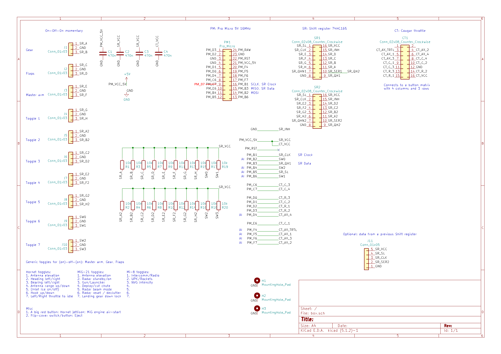
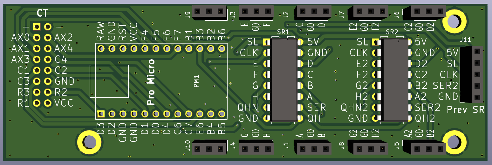
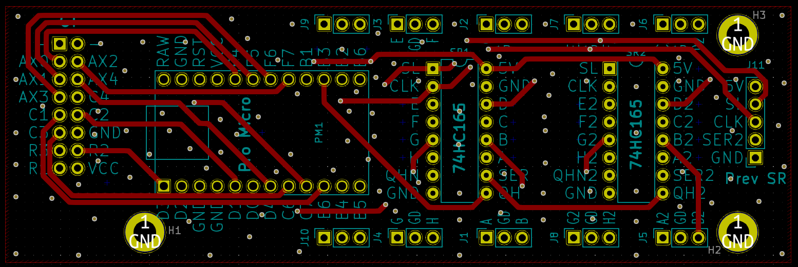
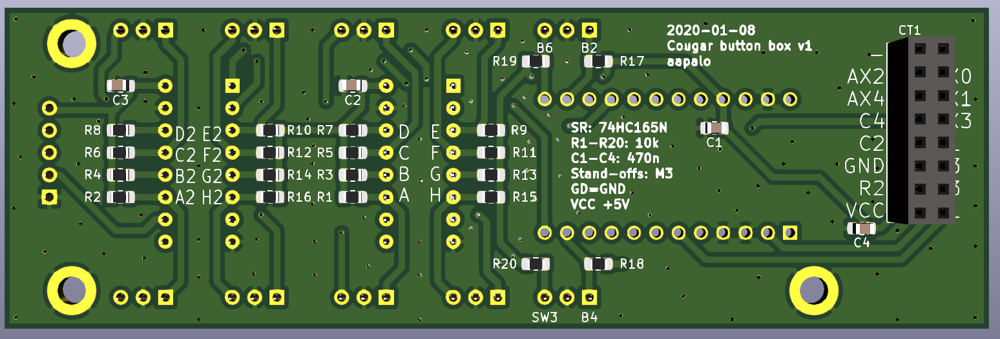
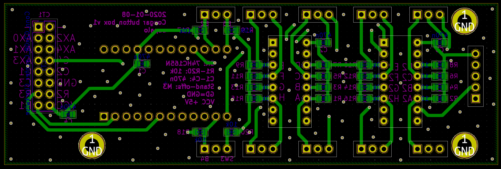
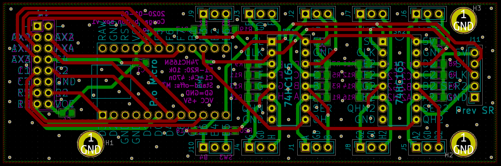

# Button box

Features:
- Can be used to convert a TM Cougar Throttle into a USB device, or as a stand-alone button box.
- Several boards can be daisy-chained via the 1x5 pin socket J11.
- The dimensions of the PCB are 112mm * 37mm.

Errata:
- Pro micro pin 9, PM_C7, should be PM_D7

----

The required components include:
- Arduino board, Pro Micro 5V/16MHz ATmega32U4
- Shift register, 74HC165N, DIP-16
- SMD resistors, 10k Ohm, 0805
- SMD capacitors, 470nF, 0805
- Pin sockets and/or headers, 2.54mm pitch
- Buttons/switches
- Jumper wires for the buttons/switches

----

The recommended software to program the Pro Micro is MMJoy2:
<https://simhq.com/forum/ubbthreads.php/topics/3899105/mmjoy-mmjoy2-build-your-own-usb-controller>

When used as a stand-alone button box, the board should fit inside a Hammond [1591C*](1) or a [1591XXC](2) enclosure.

[1]: <http://www.hammondmfg.com/dwg2.htm>
[2]: <https://www.hammfg.com/part/1591XXCBK>
[3]: <http://www.hammondmfg.com/dwg2XX.htm>

----

[//]: # (Todo: add pictures of a soldered version)

The schematic, with some of the planned DCS key bindings visible:

Top side, with the 3d view and layout view:

Bottom side, with the 3d view and layout view:

Both the top and bottom layer visible:

